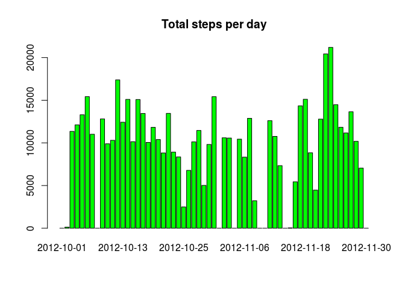
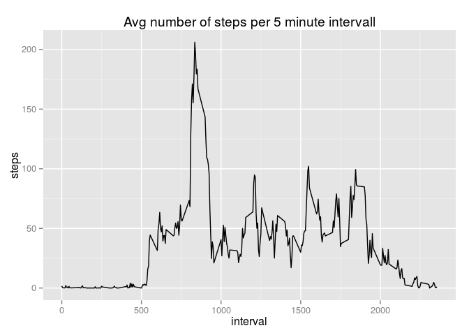
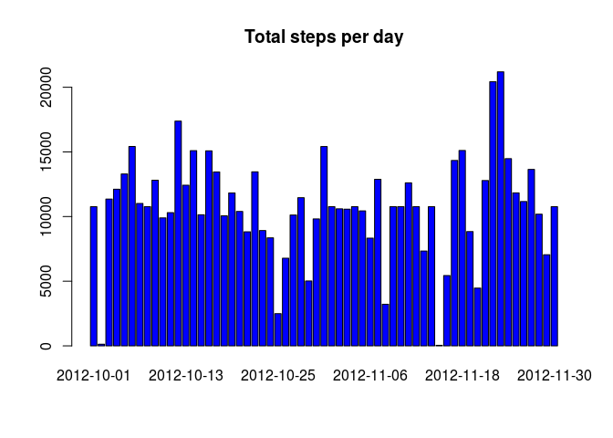
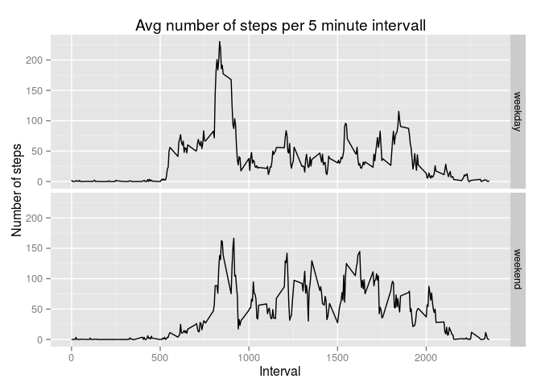

# Reproducible Research: Peer Assessment 1


## Loading and preprocessing the data
The raw data comes with the forked and cloned 
[GitHub repository created for this
assignment](http://github.com/rdpeng/RepData_PeerAssessment1).


```r
if (!file.exists("activity.csv")) { unzip("activity.zip") }
data <- read.csv("activity.csv")
```

The variables included in the dataset are:

* **steps**: Number of steps taking in a 5-minute interval (missing
    values are coded as `NA`)

* **date**: The date on which the measurement was taken in YYYY-MM-DD
    format

* **interval**: Identifier for the 5-minute interval in which
    measurement was taken
    
The *date* of the raw data is transformed to a *Date*.

```r
data$date <- as.Date(data$date, format="%Y-%m-%d")
```

## What is mean total number of steps taken per day?
1. Histogram of the total number of steps taken each day:

```r
totalStepsPerDay <- sapply(split(data$steps,data$date), sum, na.rm = T)
barplot(totalStepsPerDay, main = "Total steps per day",  col = "green")
```

 

2. **mean** and **median** total number of steps taken per day. 


```r
s <- summary(totalStepsPerDay)
s["Mean"]
```

```
## Mean 
## 9354
```

```r
s["Median"]
```

```
## Median 
##  10400
```

## What is the average daily activity pattern?


```r
avgStepsPerInterval <- with(data, aggregate(steps ~ interval, FUN = mean, na.rm = T))
library(ggplot2)
qplot(interval, steps, geom="path", data = avgStepsPerInterval, main="Avg number of steps per 5 minute intervall")
```

 

The 5-minute interval, which, on average across all the days in the dataset, contains the maximum number of steps is:


```r
minterval <- avgStepsPerInterval[avgStepsPerInterval$steps==max(avgStepsPerInterval$steps),1]
minterval
```

```
## [1] 835
```

This is the 5 minutes time interval starting at  13h55m.

## Imputing missing values
The presence of missing days may introduce
bias into some calculations or summaries of the data.

1. There are missing values in the dataset. We examine the different columns for missing values. There are no missing values in the *date* and *interval* column:


```r
sum(is.na(data$date))
```

```
## [1] 0
```

```r
sum(is.na(data$interval))
```

```
## [1] 0
```

There are missing values in the column *steps*:

```r
sum(is.na(data$steps))
```

```
## [1] 2304
```

2. The missing values of the *steps* in the dataset are substituded by the mean of the steps of the respective 5-minute interval.

3. The new dataset that is equal to the original dataset but with the missing data filled in is *datam*.


```r
library(dplyr) ## for mutate
```

```
## 
## Attaching package: 'dplyr'
## 
## The following object is masked from 'package:stats':
## 
##     filter
## 
## The following objects are masked from 'package:base':
## 
##     intersect, setdiff, setequal, union
```

```r
fu <- function(inter) { avgStepsPerInterval[avgStepsPerInterval$interval == inter,2] }
datam <- mutate(data, av = sapply(data$interval, FUN = fu))
datam$nsteps <- ifelse(is.na(datam$steps),datam$av, datam$steps)
summary(data$steps)
```

```
##    Min. 1st Qu.  Median    Mean 3rd Qu.    Max.    NA's 
##    0.00    0.00    0.00   37.38   12.00  806.00    2304
```

```r
summary(datam$nsteps)
```

```
##    Min. 1st Qu.  Median    Mean 3rd Qu.    Max. 
##    0.00    0.00    0.00   37.38   27.00  806.00
```

4. Histogram of the total number of steps taken each day and Calculate and report the **mean** and **median** total number of steps taken per day. Do these values differ from the estimates from the first part of the assignment? What is the impact of imputing missing data on the estimates of the total daily number of steps?


```r
noNaTotalStepsPerDay <- sapply(split(datam$nsteps,datam$date), sum, na.rm = T)
barplot(noNaTotalStepsPerDay, main = "Total steps per day",  col = "blue")
```

 

The **mean** and **median** of the total number of steps taken per day of the new data differ from the original data. 
*s* the summary of the original data:

```r
s
```

```
##    Min. 1st Qu.  Median    Mean 3rd Qu.    Max. 
##       0    6778   10400    9354   12810   21190
```
*noDas* is the summary of the the new data.

```r
noNas <- summary(noNaTotalStepsPerDay)
```

Difference of **mean** and **median** with respect to the data with NA's:

```r
noNas["Mean"] - s["Mean"]
```

```
## Mean 
## 1416
```

```r
noNas["Median"] - s["Median"]
```

```
## Median 
##    370
```

```r
(noNas["Mean"] - s["Mean"])/s["Mean"]
```

```
##      Mean 
## 0.1513791
```

```r
(noNas["Median"] - s["Median"])/s["Median"]
```

```
##     Median 
## 0.03557692
```

## Are there differences in activity patterns between weekdays and weekends?

1. The new factor variable *weekdayf* is created in the dataset with two levels -- "weekday" and "weekend" indicating whether a given date is a weekday or weekend day.

```r
Sys.setlocale("LC_TIME", "C")
```

```
## [1] "C"
```

```r
datam$weekdayf <- factor( ifelse(weekdays(datam$date) %in% c("Sunday", "Saturday"), "weekend", "weekday"))
```

1. A panel plot is created containing a time series plot of the 5-minute interval (x-axis) and the average number of steps taken, averaged across all weekday days or weekend days (y-axis). 


```r
library(ggplot2)
a <- with(datam, aggregate(nsteps ~ interval + weekdayf, FUN = mean))
p <- ggplot(a, aes(interval, nsteps)) + geom_line() + ylab("Number of steps") +xlab("Interval") + ggtitle("Avg number of steps per 5 minute intervall")
p + facet_grid(weekdayf ~ .)
```

 
The plot shows some differences in the activitiy pattern between weekdays and weekends.
On weekdays there many steps in the morning, when going to work or school. 
On weekends there are more steps during the normal working hours.

